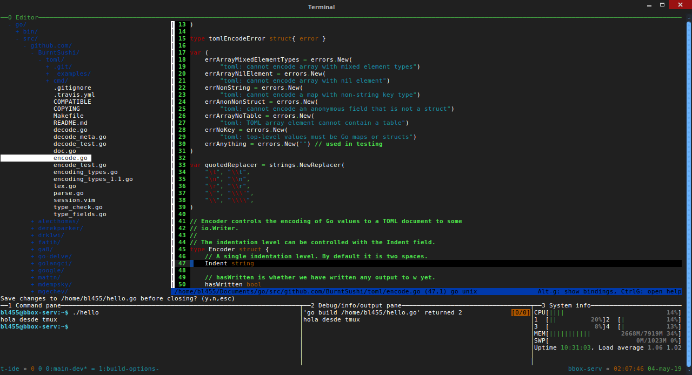

      _______         ___   ______   _______ 
     |       |       |   | |      | |       |
     |_     _| ____  |   | |  _    ||    ___|
       |   |  |____| |   | | | |   ||   |___ 
       |   |         |   | | |_|   ||    ___|
       |   |         |   | |       ||   |___ 
       |___|         |___| |______| |_______|

# Tmux based IDE 



## Getting Started

These instructions will get you Tmux based IDE

### Prerequisites

What things do you need to use t-ide:

```
latest tmux:              https://github.com/tmux/tmux
tmuxp session-manager:    https://github.com/tmux-python/tmuxp
ttop:                     https://github.com/ton1517/ttop
micro text editor:        https://github.com/zyedidia/micro
 micro filemanager plugin: https://github.com/NicolaiSoeborg/filemanager-plugin
 micro mcompiler plugin:   https://github.com/Odyssey2247/mcompiler
```

### Running

After installing the prerequisites write in the terminal:

```
$ git clone https://github.com/Odyssey2247/t-ide
$ cd t-ide
$ chmod +x install.sh
$ sudo ./install.sh
$ tide
```
this open a tmux based ide

## Use

when t-ide runs you have 2 working windows:


	0:main-dev 

this windows contains text editor(micro) pane, command pane, debug/info/output pane, systeminfo pane

	1:build-options


This window opens the main configuration of the mcompiler plugin to 
be configured with custom parameters for commands "runc" and "build"
in this windows change this:
 
    os.execute(runn)                       
    --os.execute("tmux run-shell -t 2 '" .. runn .. "' " )

for this:
 
    --os.execute(runn)
    os.execute("tmux run-shell -t 2 '" .. runn .. "' " )
	
to get all the output in panel 2 of the main window
this file is in

    ~/.config/micro/plugins/mcompiler/mcompiler.lua

to compile or run your code open command mode in micro (ctrl+e) and use commands:

    runc   //run your code 
    build  //build yourcode
    
the output of the commands is shown in panel 2 (debug/info/output pane)
use the keybindings of tmux to move between the panels and or modify the panels

### Micro commands

use the micro commands to:
-open tabs
-open file manager
-split panels
-and more
A complete list of commands accepted by micro is here: https://github.com/zyedidia/micro/blob/master/runtime/help/commands.md

### Micro and filemanager plugin

micro is highly configurable and extensible via plugins. 
one of these plugins is filemenager allows you to have a 
directory tree to the left of the editing window (like an ide)

to open a tree hit ctrl+e and:

    tree

to move use:

    cursors up and down  

to open file:

    press tab

to close current pane (in micro):

    ctrl+q

to move between panels (in micro):

    ctrl+w

to open a new tab 
  
    ctrl+t

move between tabs

    alt+. alt+,

to start the file tree whenever the micro starts 
open command mode in micro (ctr+e) and:

    set filemanager-openonstart true

more options for this plugin: https://github.com/NicolaiSoeborg/filemanager-plugin

### Micro keybindings

micro accepts keybindings instead of commands

simple, create a file called bindings.json in:

	~/.config/micro

with the following content

    {
    "F5": "command:runc",
    "F6": "command:build",
    "F8": "command:tree",
    "F9": "command:reload"
    }

F5: run runc command

F6: run build command

F8: show/hide filemanager

F9: reload config files (mcompiler.lua)

default list of keybindings for micro: https://github.com/zyedidia/micro/blob/master/runtime/help/keybindings.md

### Config t-ide panels

The configuration of the layout of the panels, titles and their size is in the file:

    /etc/t-ide/dev.yaml

add this to .tmux.conf for pane titles

    set -g pane-border-format "#{pane_index} #{pane_title}"
    set -g pane-border-status top
